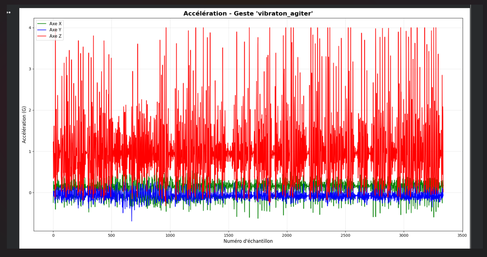
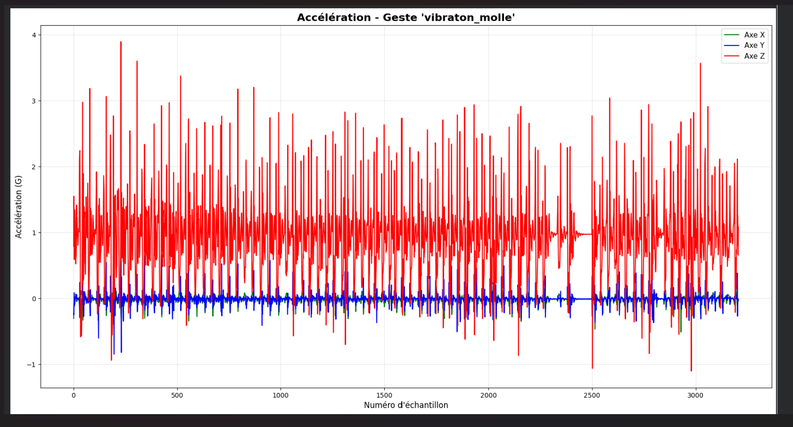
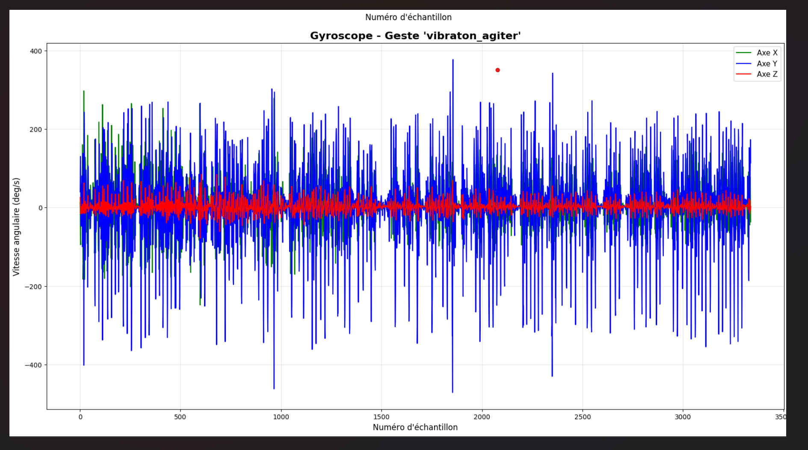
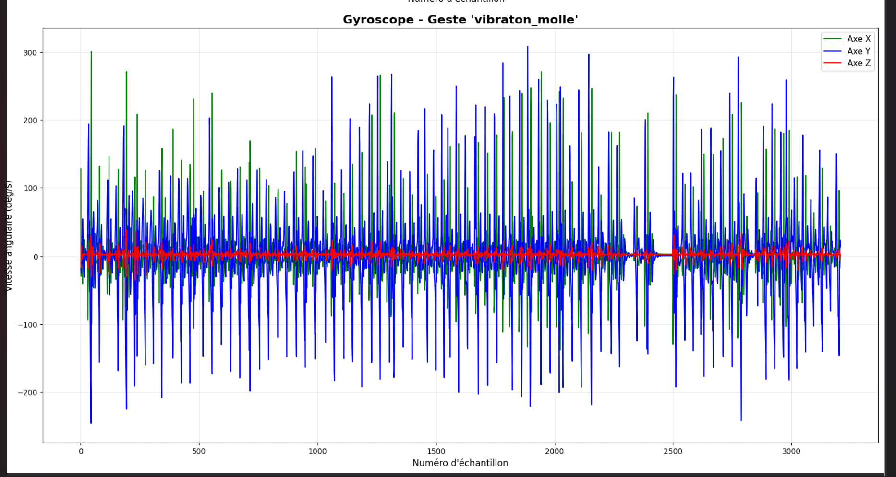
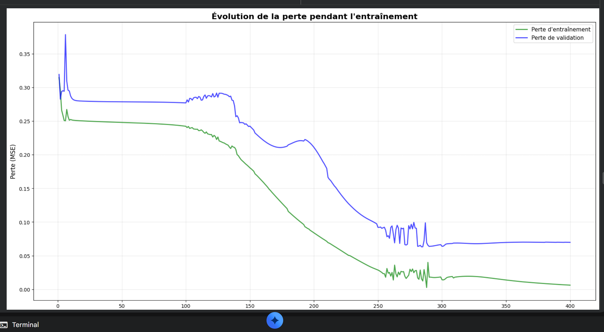
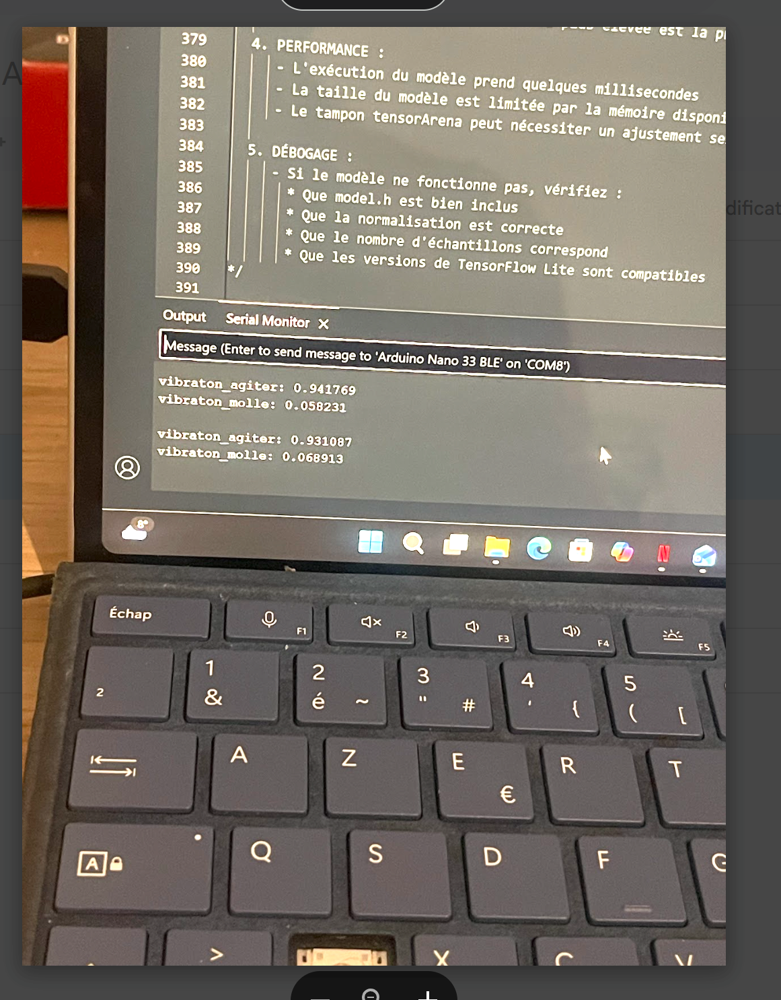
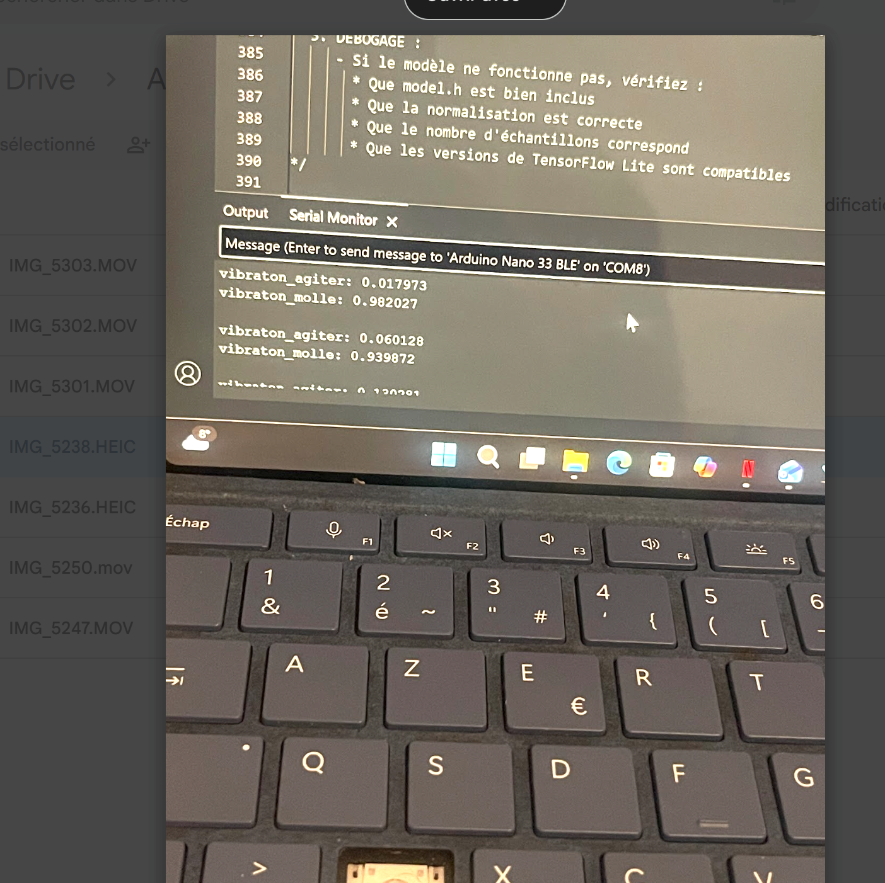

2 vibration ont été produit une vibration molle et une vibration agiter (description sur les vidéos) dont nous pouvons voir les différence en visualisant le dataset  s'accentuent pour l'accéleration suivant Z et le gyroscope suivant Y.
   
Ensuite en s'appuyant sur l'échantillonnage effectuer l'encodage des données par one-hot:
  vibraton_agiter: [1. 0.]
  vibraton_molle: [0. 1.]
Nous permettant de transformer les 2 types de vibrations en vecteurs numériques qui servira de label (1  indiquant la classe active).
Aprés avoir mélanger aléatoirement les labels  2 couches une premiere de 50 neurones et deuxiéme de 15 neurones d'activation RELU et une couche de sortie softmax sont utiliser pour entrainer le modéle sur 400 epoch.
Autrement dit, pour la première couche, on a 714 paramètres plus un biais, répétés 50 fois.Pour la deuxième couche, 50 paramètres plus un biais, répétés 15 fois.Enfin, 15 paramètres plus un biais, répétés 2 fois ,pour la couche de sortie.Ces paramètres sont ensuite ajustés en parcourant l’ensemble des données plusieurs fois (400). À chaque passage, le modèle produit une prédiction, transformée en probabilités grâce à la fonction softmax, puis comparée à la classe réelle et d’ajuster progressivement les paramètres afin de minimiser la loss,l’écart entre la valeur prédite et la valeur réelle de la classe.Et chaque neurone pouvant etre interpréter une motif particulier sur le dataset (accéleration rapide, gyroscope faible etc...).
Ainsi nos perte pour les données d'entrainement et validation converge parfaitement vers 0 traduisant aucune overfiting une modéle s'adaptant bien sur les données.

Nous pouvons trés bien le voir avec l'inférence où les classe suivant les types de vibration ont été trés bien prédite avec une trés forte probabilités.
